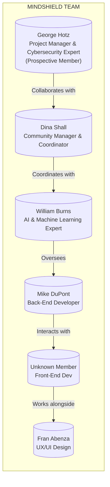

```mermaid
graph TD;

    subgraph MIND_INTERFACES["MINDSHIELD TEAM"];

    direction TB;

        George_Hotz[("George Hotz\nProject Manager & Cybersecurity Expert\n(Prospective Member)")];
        Dina_Shall[("Dina Shall\nCommunity Manager & Coordinator")];
        William_Burns[("William Burns\nAI & Machine Learning Expert")];
        Mike_DuPont[("Mike DuPont\nBack-End Developer")];
        Unknown1[("Unknown Member\nFront-End Dev")];
        Fran_Abenza[("Fran Abenza\nUX/UI Design")];

        George_Hotz -->|Collaborates with| Dina_Shall;
        Dina_Shall -->|Coordinates with| William_Burns;
        William_Burns -->|Oversees| Mike_DuPont;
        Mike_DuPont -->|Interacts with| Unknown1;
        Unknown1 -->|Works alongside| Fran_Abenza;

    end;
```
